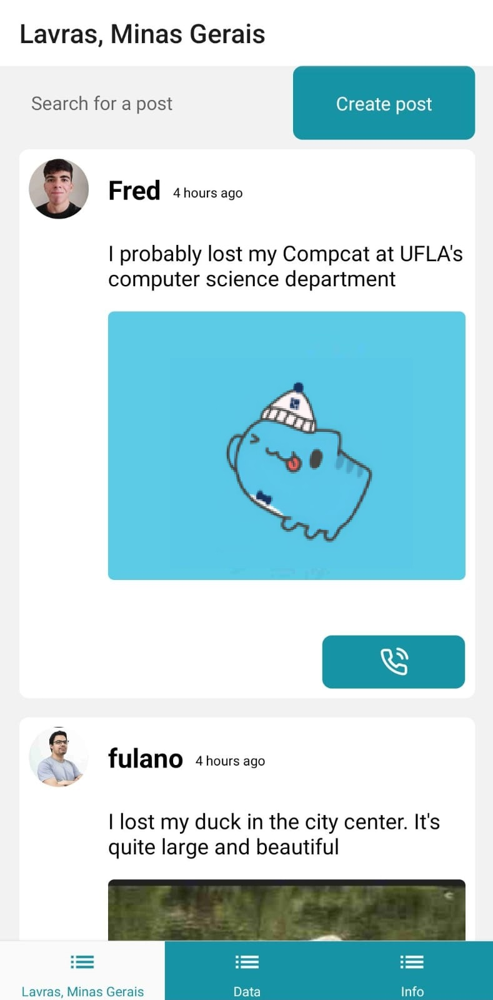
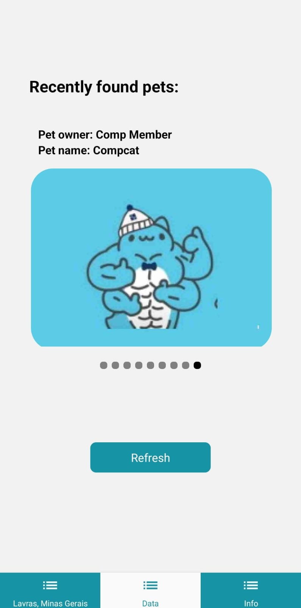
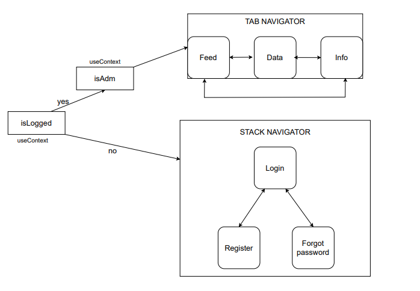

# Find Your Pet app - Mobile

## Overview

The "Find Your Pet" app is a platform built to help reunite lost pets with their owners. Leveraging the power of React Native for the mobile interface, Express for the backend, and MongoDB for data storage, the app provides a seamless experience for users looking to connect with pet owners in their local area.

<br>
<br>

| Feed                                                                             | Pet's carousel                                                     | Profile                                                             |
| -------------------------------------------------------------------------------- | ------------------------------------------------------------------ | ------------------------------------------------------------------- |
|  |  |  |

## Features

- **Localized posts**: Upon login, users are presented with posts of lost pets based on their current location, which is defined by grabbing data from IBGE's API.
- **Connect with pet owners**: Users can easily reach out to the owners of lost pets through the app.
- **Found pet carousel**: Once a lost pet is found, owners can add it to the carousel of found pets, making it visible to everyone using the app.

## Diagram structure

<p align="center">

</p>

## How to Run it

1. Make sure you have [Node.js](https://nodejs.org/), [Yarn](https://yarnpkg.com/) and [ExpoCLI](https://docs.expo.dev/more/expo-cli/) installed.
2. Run backend server. You can checkout the backend repository by clicking [here](https://github.com/FredMaia/FindYourPet-Backend)
3. To configure the axios requests to backend, you need to put your IPv4 in the .env file.
4. Navigate to the mobile app directory.
5. Run the following commands:

```bash
yarn install
yarn start
```

This project were made to **CompJR** recruitment process
